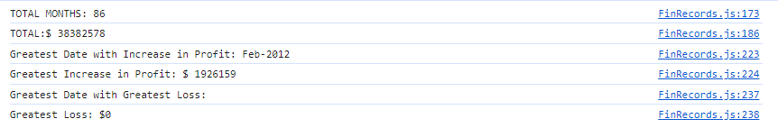

# Console Finances 

  ## Description 

  Using the Console we have been given a dataset composed of arrays with two fields, Date and Profit/Losses. My task was to filter through the the data to find the total number of months, the net total amount of profit/losses over the entire period. Track the total change in profit/losses are from month to month and then find the average over the course of the dataset. To find the greatest increase and decrease in profit/losses with the date amount over the entire period.

  

## Table of Contents

-  Description
-  Stack
-  Details
-  License
-  Support

## Stack

- Built Using: 
-HTML,JavaScript

## Details
- Here you can find some more information about this repository;

- To run this you will need to : -
- To test run this : undefined

## License
- This Project is Under the License of 

## Support
- If you have any concerns please reach out to Alan-Chumbley at:  alanchumbley28@gmail.com